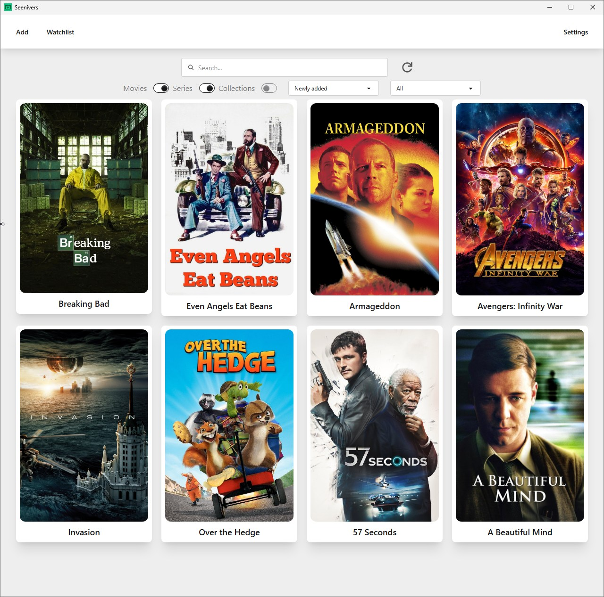
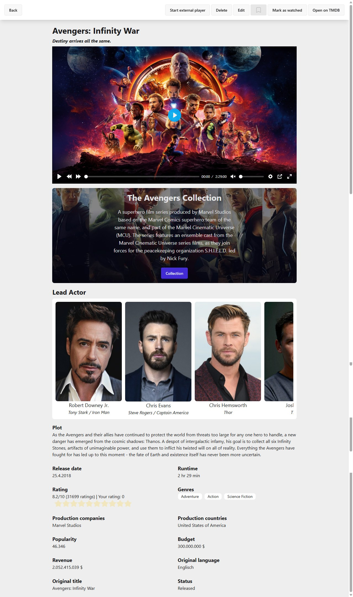
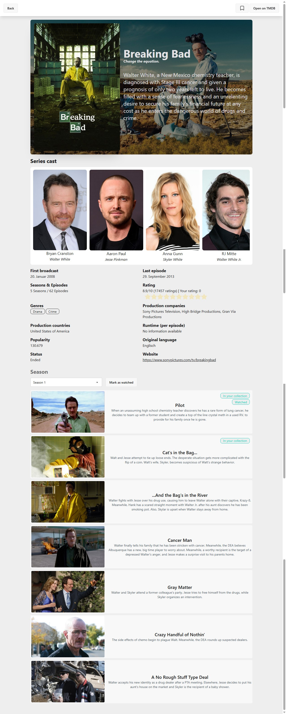
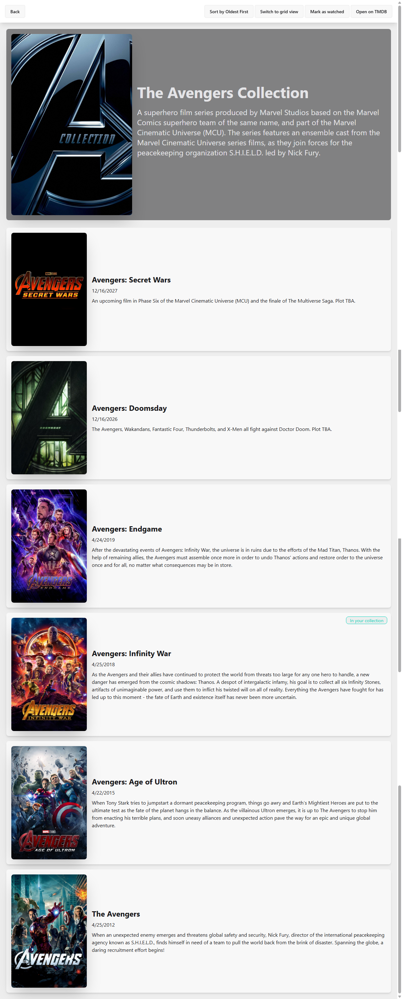
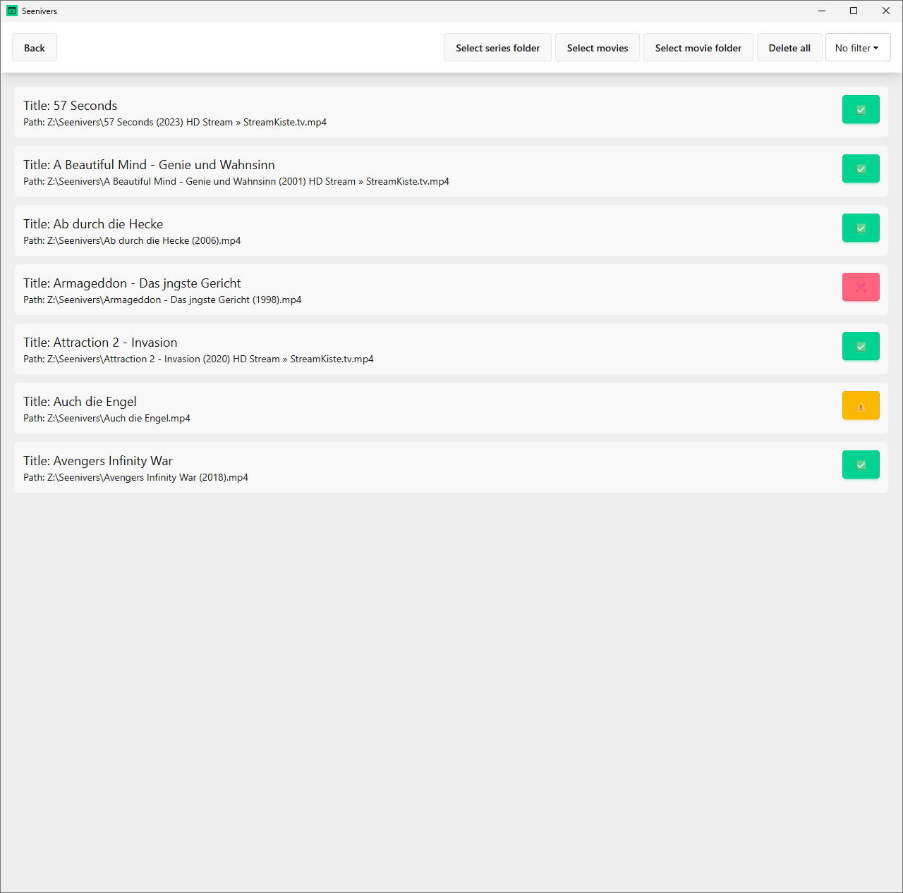

# ✨ Seenivers

Welcome to **Seenivers** – your ultimate desktop app for managing and playing movies and series locally. Whether you want to keep your entire media library organized, browse in Dark Mode, or enjoy offline playback without an internet connection, Seenivers makes it possible!

## 🚀 Features

- **Media Import & TMDB Data**  
  Add movies and series and automatically enrich them with cover art, descriptions, and cast info from TMDB.  
- **Offline Support**  
  Posters, descriptions and metadata are stored locally—always accessible, even without internet.  
- **Sort, Search, Filter**  
  Instantly browse your library by genre, year, rating or title.  
- **Mark as “Watched”**  
  Track what you’ve already seen and stay on top of your watch history.  
- **In-App Updater**  
  Install updates directly from within the app—no manual downloads required.  
- **Video Playback**  
  Built‑in player (Plyr or Vidstack) or open with your favorite media player.  
- **Dark Mode**  
  Easy on the eyes—perfect for long binge‑watch sessions.  
- **Backups & Restore**  
  Keep your library backed up, configurable right in the app — including **automatic backups** if you like.  
- **Automatic Updates**  
  Movies, series and collections keep themselves up to date.  
- **PIP Mode (Picture‑in‑Picture)**  
  Continue working, chatting or browsing while your movie plays in a mini‑window.  
- **i18n (Internationalization)**  
  Available in multiple languages — help us translate Seenivers via Crowdin!  
  🔗 [Contribute translations on Crowdin](https://crowdin.com/project/seenivers)  
- **Free & Open Source**  
  Always free to use, with fully open source code on GitHub.

## 📥 Download & Latest Releases

Get the newest version here:  
➡️ [Seenivers Releases on GitHub](https://github.com/Seenivers/App/releases)

## 📸 Screenshots

A few impressions of Seenivers in action:

### 🏠 Main View  

### 🎥 Movie Detail  

### 📺 TV Show Detail  

### 📂 Collection View  

### ➕ Add New Media  

## 🤝 Contribute & Feedback

Your ideas make Seenivers better!

- **Feature Suggestions & Discussions**  
  Tell us what’s missing or how we can improve:  
  <https://github.com/orgs/Seenivers/discussions>  
- **Bugfixes & Pull Requests**  
  Want to improve the code? Simply fork, tweak, and open a pull request—we’d love your contributions!

## 📜 License

Seenivers is licensed under the **GNU General Public License v3.0**  
🔗 [View License](https://github.com/Seenivers/.github/blob/main/LICENSE)

---

> Your feedback and contributions drive Seenivers forward. Thank you for being part of the community! ❤️

*Seenivers – your local movie & series hub.*
