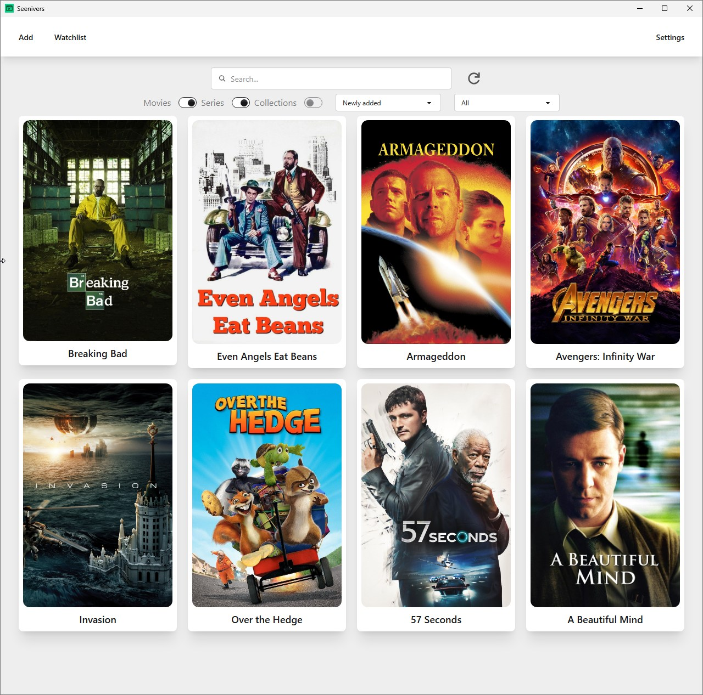
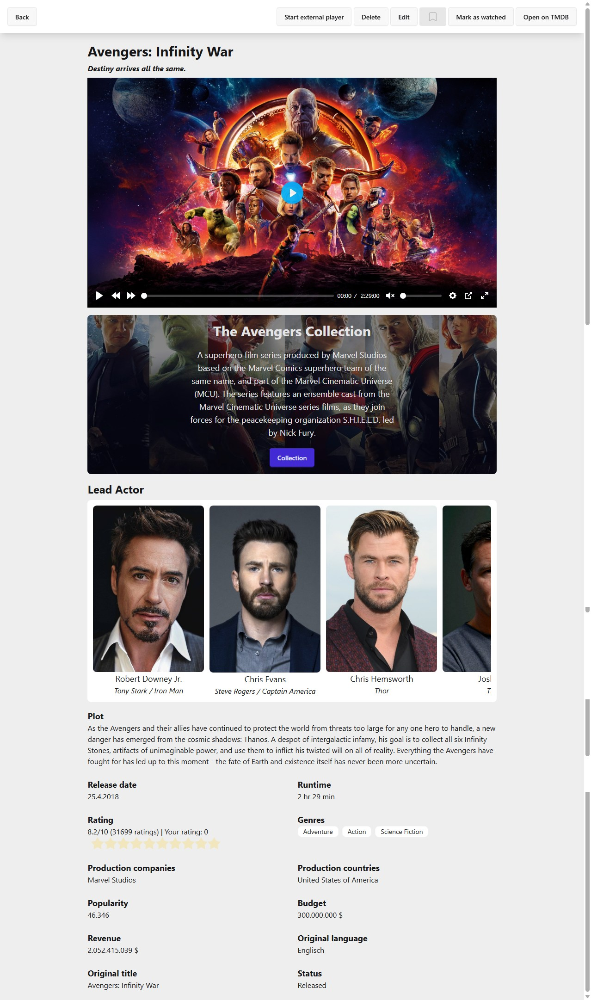
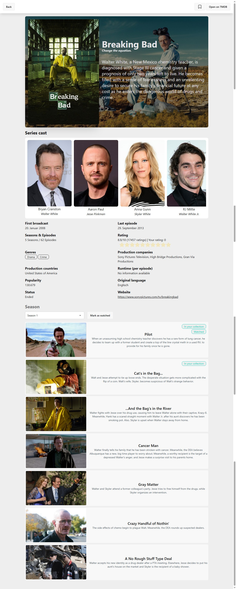
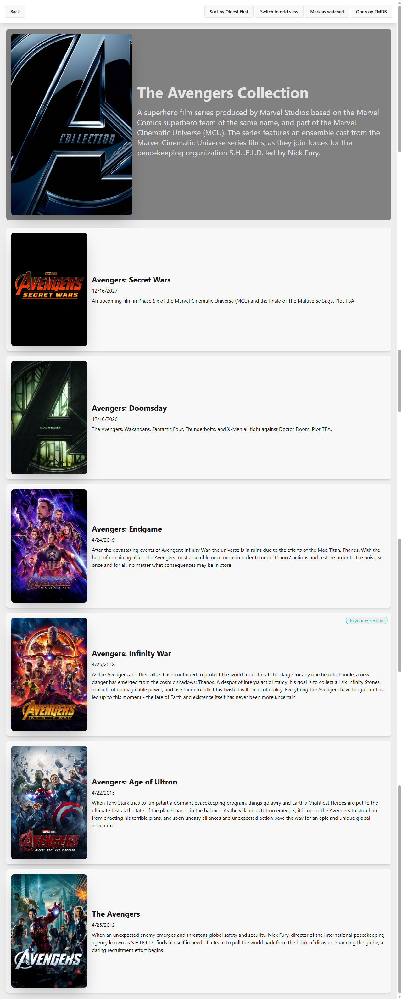
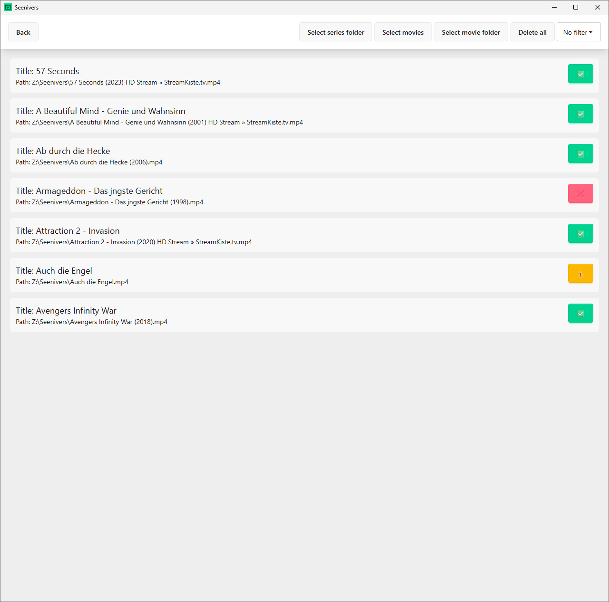

# ✨ Seenivers

Seenivers is a desktop application for managing and playing a local movie and series library.

The project was developed as a personal open-source project and is now **no longer under active development**. The final release is maintained as the project's last stable state for reference, personal use, and portfolio purposes.

## 📌 Project Status

**Seenivers is archived and no longer actively developed.**

The final maintenance release focuses on preserving the existing application in a clean and reproducible state. No further feature development, platform expansion, or major architectural changes are planned.

The application currently supports:

* **Windows 10 / 11** — supported
* **Linux** — currently unsupported
* **macOS** — untested

Seenivers depends on its web/API infrastructure for parts of its metadata and synchronization functionality. The associated infrastructure may be discontinued in the future, which can affect functionality of existing application versions.

## 🚀 Features

* Media library management for movies and series
* TMDB metadata and artwork
* Local metadata storage
* Search, sorting and filtering
* Watched status and watch history
* Local video playback
* Picture-in-Picture mode
* Automatic backups and restore
* In-app updates
* Multiple language support
* Open-source codebase

## 📥 Final Release

The latest and final release is available here:

[Seenivers Releases on GitHub](https://github.com/Seenivers/App/releases)

## 📦 Repositories

The Seenivers organization contains the different components of the project:

* [App](https://github.com/Seenivers/App) — Desktop application
* [Website](https://github.com/Seenivers/Website) — Website
* [api](https://github.com/Seenivers/api) — API
* [db](https://github.com/Seenivers/db) — Database schema and migrations
* [Seenivers](https://github.com/Seenivers/Seenivers) — Organization/project resources
* [.github](https://github.com/Seenivers/.github) — Organization configuration and documentation
* [Issue-Tracker](https://github.com/Seenivers/Issue-Tracker) — Project issue tracking

## 📸 Screenshots

### Main View

### Movie Detail

### TV Show Detail

### Collection View

### Add New Media

## 📜 License

Seenivers is licensed under the **GNU General Public License v3.0**.

[View License](https://github.com/Seenivers/.github/blob/main/LICENSE)

---

Seenivers was developed as a personal project and is preserved as a reference for its architecture, implementation, and development history.
